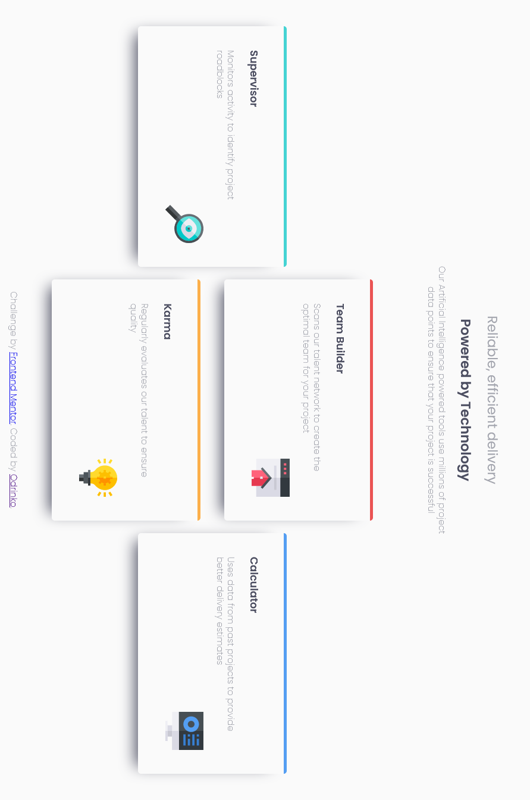

# Frontend Mentor - Four card feature section solution

This is a solution to the [Four card feature section challenge on Frontend Mentor](https://www.frontendmentor.io/challenges/four-card-feature-section-weK1eFYK). Frontend Mentor challenges help you improve your coding skills by building realistic projects. 

## Table of contents

- [Overview](#overview)
  - [The challenge](#the-challenge)
  - [Screenshot](#screenshot)
  - [Links](#links)
- [My process](#my-process)
  - [Built with](#built-with)
  - [What I learned](#what-i-learned)
  - [Continued development](#continued-development)
  - [Useful resources](#useful-resources)
- [Author](#author)
- [Acknowledgments](#acknowledgments)

## Overview

### The challenge

Users should be able to:

- View the optimal layout for the site depending on their device's screen size

### Screenshot

### Links

- Solution URL: [Add solution URL here](https://github.com/Odrinko/second-challenge)
- Live Site URL: [Add live site URL here](https://odrinko.github.io/second-challenge/)

## My process

### Built with

- Semantic HTML5 markup
- CSS custom properties
- CSS Grid
- Mobile-first workflow

### What I learned

I learn a litle bit more about **CSS GRID**

### Continued development

maybe in my next proyect i will update the first one and this one with **JS** and i will use a **SASS* for try to be a modular proyect.

### Useful resources

- [Example resource 1](https://css-tricks.com/snippets/css/complete-guide-grid/) - This helpme with somethings abous **CSS grid**
- [Example resource 2](https://www.cssmatic.com/box-shadow) - This is where i make my box shadow its realy easy to use

## Author

- Website - [https://github.com/Odrinko](https://www.your-site.com)
- Frontend Mentor - [@Odrinko](https://www.frontendmentor.io/profile/Odrinko)

